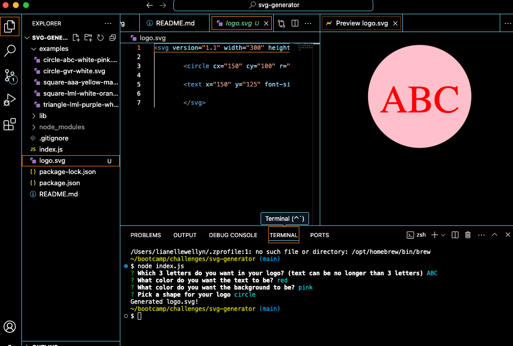

# <SVG Generator>

## Description

As a freelance web developer I want to create a logo generator so that the user doesn't need to pay a graphic designer to produce a logo.

## Installation

The user needs to install the `inquirer@8.2.4` and `jest` dependencies to utilize this program.

## Usage

Upon running the program using the command `node.index.js` the user will be presented prompts about how they want their logo to look. The text in the logo must only be 3 letters max. After completing the prompts the user will receive a message and a file to their generated design, `logo.svg`

## Links
